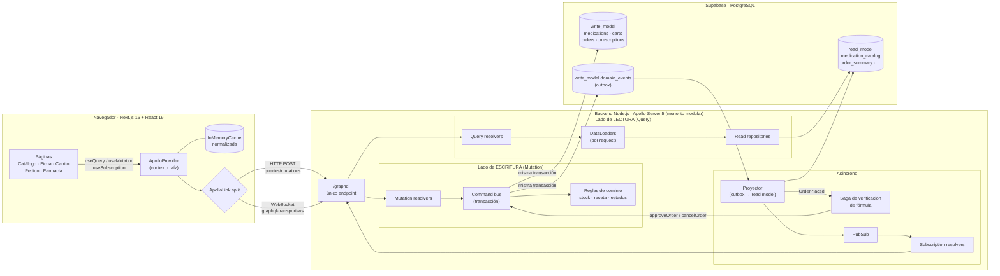
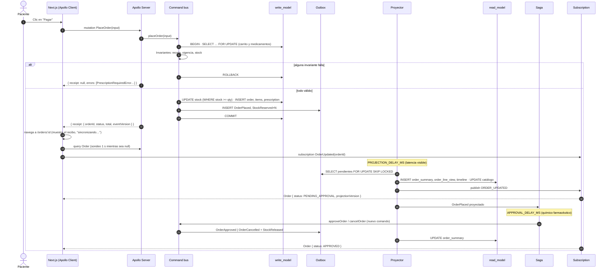
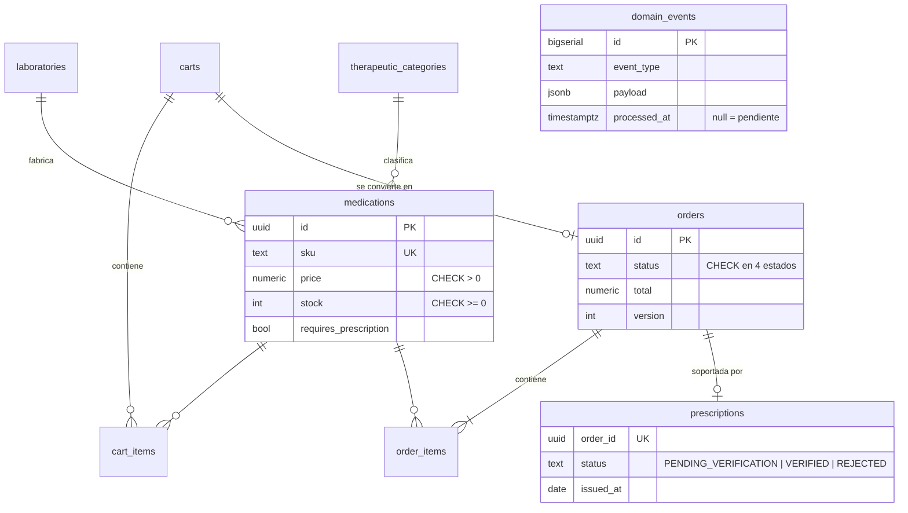

# Arquitectura de Afirmative Pill

Este documento amplía el [README](../README.md): describe los componentes, el flujo de un comando de punta a punta, el modelo de datos y las decisiones de diseño con sus alternativas.

## 1. Vista de componentes

| Capa | Carpeta | Responsabilidad |
|---|---|---|
| Contrato | `backend/schema.graphql` | Schema SDL: única interfaz pública del sistema. |
| Adaptadores GraphQL | `backend/src/graphql/` | Resolvers delgados, scalars, límite de profundidad y paginación. |
| Lado de lectura | `backend/src/read/` | Repositorios que **sólo** leen `read_model` + DataLoaders. |
| Lado de escritura | `backend/src/write/` | Command bus, comandos, reglas de dominio puras y saga. |
| Eventos | `backend/src/events/` | Outbox, proyector y PubSub para suscripciones. |
| Persistencia | `supabase/` | Migraciones, dataset y seed. |
| Cliente | `frontend/src/` | Apollo Client, operaciones tipadas y páginas. |

## 2. Flujo de un comando: `placeOrder`

## 3. Modelo de datos

### 3.1 Write model (normalizado, fuente de verdad)

### 3.2 Read model (desnormalizado, optimizado por pantalla)

| Tabla | Pantalla | Por qué existe |
|---|---|---|
| `medication_catalog` | Catálogo y ficha | Una fila por medicamento con `availability` y `search_text` precalculados. Índices trigram, por categoría, precio y nombre. |
| `laboratory_view`, `category_view` | Filtros y ficha | `category_view.medication_count` precalculado: no hay `COUNT(*)` en cada consulta. |
| `cart_view`, `cart_line_view` | Carrito | Proyección **síncrona** (read-your-writes). |
| `order_summary` | Pedido, Mis pedidos, Farmacia | Total, estado, receta y cliente en una fila; `last_event_id` sirve de versión e idempotencia. |
| `order_line_view` | Detalle del pedido | Snapshot de nombre y precio al momento de la compra. |
| `order_timeline` | Historial | Un registro por evento de cambio de estado (`event_id` único ⇒ idempotente). |

### 3.3 Eventos de dominio

| Evento | Agregado | Emitido por | Efecto en el read model |
|---|---|---|---|
| `CartUpdated` | Cart | comandos de carrito, `placeOrder` | `cart_view`/`cart_line_view` (inline) |
| `OrderPlaced` | Order | `placeOrder` | crea `order_summary`, líneas y timeline |
| `StockReserved` | Medication | `placeOrder` | `medication_catalog.stock_available` ↓ |
| `StockReleased` | Medication | `cancelOrder` | `medication_catalog.stock_available` ↑ |
| `OrderApproved` | Order | `approveOrder` (manual o saga) | estado + receta VERIFIED |
| `OrderDispatched` | Order | `dispatchOrder` | estado |
| `OrderCancelled` | Order | `cancelOrder` (manual o saga) | estado + motivo (+ receta REJECTED) |

## 4. Decisiones de diseño (ADR resumidos)

### ADR-01 · Monolito modular en lugar de federación
**Decisión:** un solo Apollo Server con módulos `read/`, `write/` y `events/` bien separados.
**Motivo:** el dominio es pequeño y la segregación CQRS ya separa las responsabilidades. La federación añadiría un router, varios subgraphs y latencia de red sin beneficio para el alcance del taller.
**Consecuencia:** si el catálogo tuviera que escalar de forma independiente, `read/` se puede extraer como subgraph `catalog` sin cambiar el contrato.

### ADR-02 · Outbox transaccional en PostgreSQL en lugar de un broker
**Decisión:** los eventos se guardan en `write_model.domain_events` dentro de la misma transacción del comando.
**Motivo:** evita el problema de *dual write* (guardar en BD y publicar en un broker por separado) y no requiere infraestructura adicional en Supabase. `FOR UPDATE SKIP LOCKED` permite varias instancias del proyector.
**Consecuencia:** latencia de proyección de milisegundos más el `PROJECTION_DELAY_MS` configurable. En producción se usaría `LISTEN/NOTIFY` o un broker (Kafka o Redis Streams) para despertar al proyector.

### ADR-03 · Reserva de inventario pesimista
**Decisión:** `SELECT … FOR UPDATE` de los medicamentos, en orden de `id`, más un `UPDATE … WHERE stock >= qty` y un `CHECK (stock >= 0)`.
**Motivo:** vender un medicamento inexistente tiene consecuencias clínicas y legales. Con el bloqueo pesimista el resultado es determinista bajo contención. El test `no vende más unidades de las disponibles bajo concurrencia` lanza 8 compras simultáneas sobre 5 unidades: exactamente 5 se confirman y 3 reciben `InsufficientStockError`.
**Alternativa descartada:** control optimista con `version`, que obliga a reintentar en el cliente justo en los picos de demanda.

### ADR-04 · Errores de negocio como datos
**Decisión:** payloads con `errors: [UserError!]!` (interfaz + 8 tipos concretos) en vez de lanzar `GraphQLError`.
**Motivo:** son parte del contrato, están tipados, se pueden introspeccionar y el cliente los discrimina por `__typename` (p. ej. muestra `available` de `InsufficientStockError`). Los errores GraphQL de nivel superior quedan reservados para fallos técnicos o input sintácticamente inválido (scalars).

### ADR-05 · Carrito con proyección síncrona
**Decisión:** el carrito también se proyecta, pero dentro de la transacción del comando.
**Motivo:** el paciente espera ver el ítem agregado de inmediato (read-your-writes). Aplicar la consistencia eventual aquí empeoraría la UX sin beneficio. Las proyecciones del catálogo y de las órdenes sí son asíncronas, porque sus lectores toleran unos cientos de milisegundos de retraso.

### ADR-06 · El comando devuelve un recibo, no la proyección
**Decisión:** `placeOrder`, `approveOrder`, `dispatchOrder` y `cancelOrder` devuelven `OrderReceipt { orderId, status, total, eventVersion }`.
**Motivo:** devolver `Order` (read model) desde una mutation mentiría: la proyección aún no existe cuando la transacción hace COMMIT. El recibo es lo que el write model sabe con certeza, y `eventVersion` permite a la UI saber cuándo la proyección (`projectionVersion`) lo alcanzó.

### ADR-07 · `pg` en lugar de `supabase-js`
**Decisión:** conexión directa a PostgreSQL con `node-postgres`.
**Motivo:** `supabase-js` habla con PostgREST (REST), lo que contradice el mandato Zero-REST incluso en el tramo servidor→BD, y no permite transacciones multi-sentencia ni `FOR UPDATE`. Con `pg` también podemos agrupar consultas con `= ANY($1)` para los DataLoaders.

### ADR-08 · Esquemas `write_model`/`read_model` con RLS
**Decisión:** las tablas no viven en `public`, tienen RLS activo sin políticas y se revocan los permisos de `anon` y `authenticated`.
**Motivo:** Supabase expone `public` automáticamente por REST. Así ninguna tabla es accesible por esa vía y el único canal hacia los datos es GraphQL.

## 5. Seguridad y robustez del endpoint GraphQL

- **Límite de profundidad** (`depthLimit(8)`): rechaza consultas recursivas abusivas del tipo `laboratory → medications → laboratory → …`.
- **Tamaño de página acotado**: `first` es `PositiveInt` y se limita a 50 en el servidor.
- **Validación en el borde**: los scalars `Email`, `Date`, `PositiveInt` y `Money` rechazan el input inválido antes de que llegue a los resolvers.
- **CSRF**: la protección por defecto de Apollo Server 5 está activa (exige `content-type: application/json` o una cabecera de preflight).
- **CORS** restringido a `CORS_ORIGINS`.
- **Body limit** de 100 KB.
- **Consultas parametrizadas** en todo el código (`$1…$n`); el `LIKE` escapa `%` y `_`.
